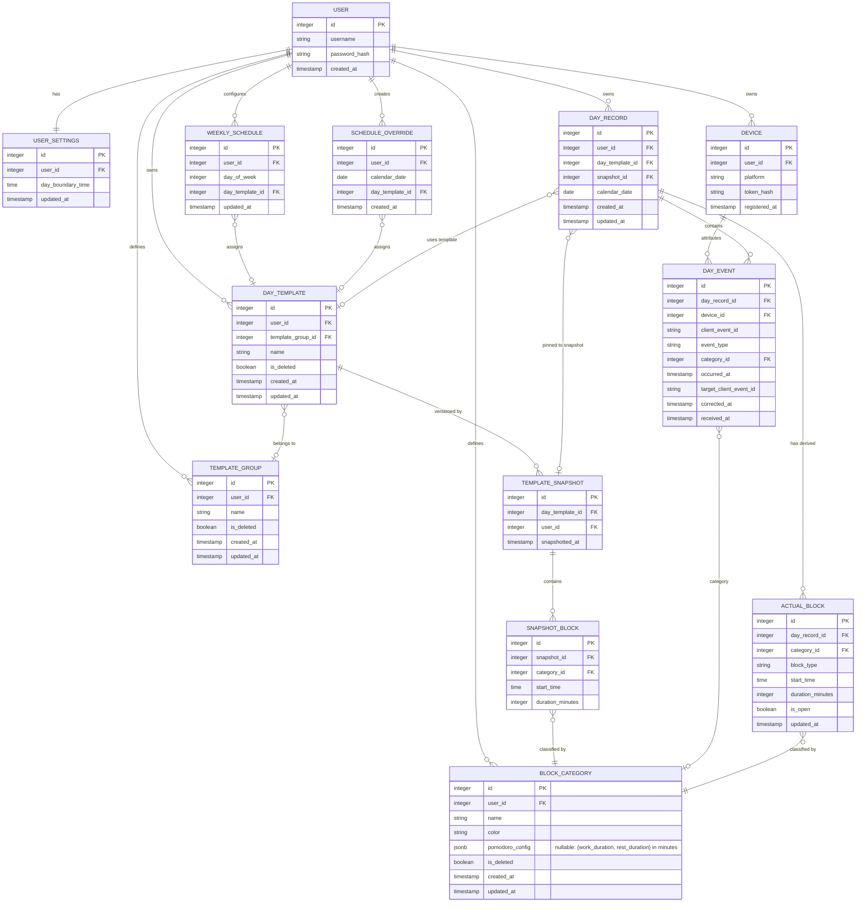

# Date and Time Formats
- **Date-only values** — `YYYY-MM-DD` (ISO calendar date). Used for calendar route parameters, `calendar_date`, and `from`/`to` query parameters.
- **Schedule times** — `HH:MM` in 24-hour local time. Used for `day_boundary_time`, planned snapshot block `start_time`, and actual block `start_time`. Seconds are not returned by the API.
- **User-driven event timestamps** — ISO 8601 - `YYYY-MM-DDTHH:MM:SSZ` in UTC, for example `2026-09-06T14:26:37Z`. Used for `occurred_at`, including event corrections.
- **Server-managed timestamps** — ISO 8601 - `YYYY-MM-DDTHH:MM:SSZ` in UTC, for example `2026-09-06T14:26:37Z`. Used for `created_at`, `updated_at`, `registered_at`, `snapshotted_at`, and `received_at`.

Date-only values must not include a time or timezone. Schedule times must not include a date or timezone. Timestamp fields must use UTC and the exact `YYYY-MM-DDTHH:MM:SSZ` representation; fractional seconds and local offsets are not used.

# API Summary

- **Auth**
  - `POST /auth/register` - create account, returns JWT
  - `POST /auth/login` - authenticate, returns JWT

- **Account**
  - `DELETE /account` - hard delete all user data

- **Settings**
  - `GET /settings` - get user settings
  - `PUT /settings` - update user settings

- **Devices**
  - `POST /devices` - register a new native client device

- **Categories**
  - `GET /categories` - list all active categories
  - `POST /categories` - create category
  - `PUT /categories/{id}` - rename / recolor
  - `DELETE /categories/{id}` - soft delete

- **Template Groups**
  - `GET /template-groups` - list all active groups
  - `POST /template-groups` - create group
  - `PUT /template-groups/{id}` - rename
  - `DELETE /template-groups/{id}` - soft delete

- **Day Templates**
  - `GET /templates` - list all active templates with their current snapshot blocks inline
  - `POST /templates` - create template (send copied blocks to implement "Create From")
  - `PUT /templates/{id}` - update template metadata and create a new snapshot; active/future days using the template are re-pinned
  - `DELETE /templates/{id}` - soft delete a template

- **Schedule**
  - `GET /schedule` - get full weekly schedule and all future overrides
  - `PUT /schedule/weekly` - replace all 7 day-of-week assignments
  - `PUT /schedule/overrides/{date}` - set override for a specific date
  - `DELETE /schedule/overrides/{date}` - remove override for a specific date

- **Days**
  - `GET /days?from=&to=` - fetch existing records in date range; missing dates are omitted, and each record includes its snapshot blocks and actual blocks inline
  - `GET /days/{date}` - fetch a single day record
  - `POST /days/{date}` - create a record and pin the active template snapshot
  - `POST /days/{date}/events` - append batch of day events; auto-creates and recomputes actual blocks
  - `PUT /days/{date}/blocks` - replace the actual blocks for a day during review
  - `PUT /days/{date}/template` - re-resolve or explicitly assign the template and re-pin an active/future day

- **Client Init**
  - `POST /init` - bootstrap settings, categories, and a day record


# DB format - V1



Index Suggestions

`BLOCK_CATEGORY`
- **`(user_id, is_deleted)`** — `GET /categories` always filters by user and excludes soft-deleted rows

`TEMPLATE_GROUP`
- **`(user_id, is_deleted)`** — `GET /template-groups` always filters by user and excludes soft-deleted rows

`DAY_TEMPLATE`
- **`(user_id, is_deleted)`** — `GET /templates` always filters by user and excludes soft-deleted rows
- **`(template_group_id)`** — grouping/filtering templates by group in template library view

`TEMPLATE_SNAPSHOT`
- **`(day_template_id, snapshotted_at)`** — when a day record is created, server must find the most recent snapshot for the assigned template

`SNAPSHOT_BLOCK`
- **`(snapshot_id)`** — every day record fetch joins snapshot to its blocks; high frequency

`WEEKLY_SCHEDULE`
- **`(user_id, day_of_week)`** — schedule lookup on day record creation and `GET /schedule`; always filtered by user and day

`SCHEDULE_OVERRIDE`
- **`(user_id, calendar_date)`** — checked on every day record creation and `GET /schedule` to find overrides; date lookups are the primary access pattern

`DAY_RECORD`
- **unique `(user_id, calendar_date)`** — date-keyed routing and range queries
- **`(snapshot_id)`** — every day record fetch joins its pinned snapshot to retrieve the planned schedule

The `(user_id, calendar_date)` index must be unique. It is the lookup key for all date-keyed routes and prevents duplicate records for one user's date.

`DAY_EVENT`
- **unique `(day_record_id, client_event_id)`** — idempotent event submission
- **`(day_record_id, occurred_at)`** — events are appended and replayed in order per day record; ordering by time is required for correct block derivation
- **`(device_id, received_at)`** — event attribution and diagnostics

`ACTUAL_BLOCK`
- **`(day_record_id)`** — every day record fetch joins to its actual blocks; high frequency, same pattern as `SNAPSHOT_BLOCK`
- **`(day_record_id, start_time)`** — analytics and health view need blocks in time order within a day; also used when recomputing blocks after new events.

# API Specification

## Auth

### `POST /auth/register`
Creates a new user account and returns a JWT token.

**Input:**
```json
{
  "username": "string",
  "password": "string"
}
```

**Output `200`:**
```json
{
  "token": "string",
  "user_id": "integer"
}
```

**Errors:**
- `400` — missing or malformed fields
- `409` — username already registered

### `POST /auth/login`
Authenticates an existing user and returns a JWT token.

**Input:**
```json
{
  "username": "string",
  "password": "string"
}
```

**Output `200`:**
```json
{
  "token": "string",
  "user_id": "integer"
}
```

**Errors:**
- `400` — missing or malformed fields
- `401` — invalid credentials

## Account

### `DELETE /account`
Permanently hard-deletes the authenticated user's account and all associated data. Irreversible. Requires the user's password as confirmation.

**Input:**
```json
{
  "password": "string"
}
```

**Output `200`:**
```json
{
  "deleted": true
}
```

**Errors:**
- `401` — invalid password confirmation

## Settings

### `GET /settings`
Returns the current user settings.

**Output `200`:**
```json
{
  "day_boundary_time": "string (HH:MM)",
  "updated_at": "string (ISO 8601 - YYYY-MM-DDTHH:MM:SSZ)"
}
```

### `PUT /settings`
Replaces all user settings.

**Input:**
```json
{
  "day_boundary_time": "string (HH:MM)"
}
```

**Output `200`:**
```json
{
  "day_boundary_time": "string (HH:MM)",
  "updated_at": "string (ISO 8601 - YYYY-MM-DDTHH:MM:SSZ)"
}
```

**Errors:**
- `400` — invalid time format

## Devices

### `POST /devices`
Registers a new native client device for the authenticated user. Called once on first launch after web login. The returned `device_id` is stored locally by the client and used to identify the device in subsequent sync calls.

**Input:**
```json
{
  "platform": "string (desktop | mobile | web)"
}
```

**Output `200`:**
```json
{
  "device_id": "integer",
  "registered_at": "string (ISO 8601 - YYYY-MM-DDTHH:MM:SSZ)"
}
```

**Errors:**
- `400` — invalid or missing platform value

## Categories

Categories may optionally include a Pomodoro configuration. The durations are expressed in minutes and must be positive integers.

### `GET /categories`
Returns all non-deleted categories belonging to the authenticated user.

**Output `200`:**
```json
{
  "categories": [
    {
      "id": "integer",
      "name": "string",
      "color": "string (hex)",
      "pomodoro_config": {
        "work_duration": "integer (minutes)",
        "rest_duration": "integer (minutes)"
      },
      "created_at": "string (ISO 8601 - YYYY-MM-DDTHH:MM:SSZ)",
      "updated_at": "string (ISO 8601 - YYYY-MM-DDTHH:MM:SSZ)"
    }
  ]
}
```

### `POST /categories`
Creates a new activity category.

**Input:**
```json
{
  "name": "string",
  "color": "string (hex)",
  "pomodoro_config": {
    "work_duration": "integer (minutes)",
    "rest_duration": "integer (minutes)"
  }
}
```

`pomodoro_config` may be `null` to disable Pomodoro for the category.

**Output `201`:**
```json
{
  "id": "integer",
  "name": "string",
  "color": "string (hex)",
  "pomodoro_config": {
    "work_duration": "integer (minutes)",
    "rest_duration": "integer (minutes)"
  },
  "created_at": "string (ISO 8601 - YYYY-MM-DDTHH:MM:SSZ)",
  "updated_at": "string (ISO 8601 - YYYY-MM-DDTHH:MM:SSZ)"
}
```

**Errors:**
- `400` — missing name, invalid color format, or non-positive Pomodoro duration

### `PUT /categories/{id}`
Replaces the name and color of an existing category. Changes are reflected immediately everywhere the category appears.

**Input:**
```json
{
  "name": "string",
  "color": "string (hex)",
  "pomodoro_config": {
    "work_duration": "integer (minutes)",
    "rest_duration": "integer (minutes)"
  }
}
```

`pomodoro_config` may be `null` to disable Pomodoro for the category.

**Output `200`:**
```json
{
  "id": "integer",
  "name": "string",
  "color": "string (hex)",
  "pomodoro_config": {
    "work_duration": "integer (minutes)",
    "rest_duration": "integer (minutes)"
  },
  "updated_at": "string (ISO 8601 - YYYY-MM-DDTHH:MM:SSZ)"
}
```

**Errors:**
- `400` — missing name, invalid color format, or non-positive Pomodoro duration
- `404` — category not found or does not belong to user

### `DELETE /categories/{id}`
Soft-deletes a category. The category becomes invisible in the UI but all historical blocks referencing it remain intact. A soft-deleted category cannot be assigned to new blocks.

**Output `200`:**
```json
{
  "id": "integer",
  "deleted": true
}
```

**Errors:**
- `404` — category not found or does not belong to user

## Template Groups

### `GET /template-groups`
Returns all non-deleted template groups belonging to the authenticated user.

**Output `200`:**
```json
{
  "groups": [
    {
      "id": "integer",
      "name": "string",
      "created_at": "string (ISO 8601 - YYYY-MM-DDTHH:MM:SSZ)",
      "updated_at": "string (ISO 8601 - YYYY-MM-DDTHH:MM:SSZ)"
    }
  ]
}
```

### `POST /template-groups`
Creates a new template group.

**Input:**
```json
{
  "name": "string"
}
```

**Output `201`:**
```json
{
  "id": "integer",
  "name": "string",
  "created_at": "string (ISO 8601 - YYYY-MM-DDTHH:MM:SSZ)",
  "updated_at": "string (ISO 8601 - YYYY-MM-DDTHH:MM:SSZ)"
}
```

**Errors:**
- `400` — missing name

### `PUT /template-groups/{id}`
Replaces the name of an existing template group.

**Input:**
```json
{
  "name": "string"
}
```

**Output `200`:**
```json
{
  "id": "integer",
  "name": "string",
  "updated_at": "string (ISO 8601 - YYYY-MM-DDTHH:MM:SSZ)"
}
```

**Errors:**
- `400` — missing name
- `404` — group not found or does not belong to user

### `DELETE /template-groups/{id}`
Soft-deletes a template group. Templates previously assigned to this group retain the association in history but the group becomes invisible in the UI.

**Output `200`:**
```json
{
  "id": "integer",
  "deleted": true
}
```

**Errors:**
- `404` — group not found or does not belong to user

## Day Templates

Templates are returned with the current template snapshot and its schedule blocks inline. Snapshot blocks have no independent API surface — they are managed as part of template creation or snapshot creation on PUT.

### `GET /templates`
Returns all non-deleted templates with their current snapshot and schedule blocks.

**Output `200`:**
```json
{
  "templates": [
    {
      "id": "integer",
      "name": "string",
      "template_group_id": "integer | null",
      "current_snapshot": {
        "id": "integer",
        "snapshotted_at": "string (ISO 8601 - YYYY-MM-DDTHH:MM:SSZ)",
        "snapshot_blocks": [
          {
            "id": "integer",
            "category_id": "integer",
            "start_time": "string (HH:MM)",
            "duration_minutes": "integer"
          }
        ]
      },
      "created_at": "string (ISO 8601 - YYYY-MM-DDTHH:MM:SSZ)",
      "updated_at": "string (ISO 8601 - YYYY-MM-DDTHH:MM:SSZ)"
    }
  ]
}
```

### `POST /templates`
Creates a new template with general metadata and an initial schedule. To implement "Create From", the client sends the copied blocks from the source template as the initial `snapshot_blocks`. The server creates the first template snapshot immediately on creation.

**Input:**
```json
{
  "name": "string",
  "template_group_id": "integer | null",
  "snapshot_blocks": [
    {
      "category_id": "integer",
      "start_time": "string (HH:MM)",
      "duration_minutes": "integer"
    }
  ]
}
```

**Output `201`:**
```json
{
  "id": "integer",
  "name": "string",
  "template_group_id": "integer | null",
  "current_snapshot": {
    "id": "integer",
    "snapshotted_at": "string (ISO 8601 - YYYY-MM-DDTHH:MM:SSZ)",
    "snapshot_blocks": [
      {
        "id": "integer",
        "category_id": "integer",
        "start_time": "string (HH:MM)",
        "duration_minutes": "integer"
      }
    ]
  },
  "created_at": "string (ISO 8601 - YYYY-MM-DDTHH:MM:SSZ)",
  "updated_at": "string (ISO 8601 - YYYY-MM-DDTHH:MM:SSZ)"
}
```

**Errors:**
- `400` — missing name, invalid block fields, block duration below 30 min or not a 15-min multiple, unknown category_id
- `404` — template_group_id not found or does not belong to user

### `PUT /templates/{id}`
Replaces the template metadata and creates a new template snapshot containing the submitted schedule. Existing snapshots and their blocks are retained unchanged for historical records.

Existing active/future day records for this template are re-pinned from their old snapshot to the new snapshot. Their actual blocks and events are unchanged. Past day records are frozen and are never re-pinned automatically.

**Input:**
```json
{
  "name": "string",
  "template_group_id": "integer | null",
  "snapshot_blocks": [
    {
      "category_id": "integer",
            "start_time": "string (HH:MM)",
      "duration_minutes": "integer"
    }
  ]
}
```

**Output `200`:**
```json
{
  "id": "integer",
  "name": "string",
  "template_group_id": "integer | null",
  "current_snapshot": {
    "id": "integer",
    "snapshotted_at": "string (ISO 8601 - YYYY-MM-DDTHH:MM:SSZ)",
    "snapshot_blocks": [
      {
        "id": "integer",
        "category_id": "integer",
        "start_time": "string (HH:MM)",
        "duration_minutes": "integer"
      }
    ]
  },
  "updated_at": "string (ISO 8601 - YYYY-MM-DDTHH:MM:SSZ)"
}
```

**Errors:**
- `400` — missing name, invalid block fields, block duration below 30 min or not a 15-min multiple, unknown category_id
- `404` — template not found or does not belong to user

### `DELETE /templates/{id}`
Soft-deletes a template. The template becomes invisible in the template library. All day records that used the template retain their pinned snapshot, which is unaffected by the deletion.

**Output `200`:**
```json
{
  "id": "integer",
  "deleted": true
}
```

**Errors:**
- `404` — template not found or does not belong to user

## Schedule

### `GET /schedule`
Returns the complete weekly schedule (all 7 slots, including unassigned days) and all schedule overrides for dates from today onward.

**Output `200`:**
```json
{
  "weekly_schedule": [
    {
      "id": "integer | null",
      "day_of_week": "integer (0=Monday … 6=Sunday)",
      "day_template_id": "integer | null",
      "updated_at": "string (ISO 8601 - YYYY-MM-DDTHH:MM:SSZ) | null"
    }
  ],
  "overrides": [
    {
      "id": "integer",
      "calendar_date": "string (YYYY-MM-DD)",
      "day_template_id": "integer | null",
      "created_at": "string (ISO 8601 - YYYY-MM-DDTHH:MM:SSZ)"
    }
  ]
}
```

### `PUT /schedule/weekly`
Replaces the full weekly schedule. All 7 days of the week must be included. Days with no template assigned should have `day_template_id: null`. Changes apply to active and future dates — past day records are frozen and unaffected. Existing active/future day records are re-resolved and re-pinned when their assignment changes.

**Input:**
```json
{
  "weekly_schedule": [
    {
      "day_of_week": "integer (0–6)",
      "day_template_id": "integer | null"
    }
  ]
}
```

**Output `200`:**
```json
{
  "weekly_schedule": [
    {
      "id": "integer",
      "day_of_week": "integer",
      "day_template_id": "integer | null",
      "updated_at": "string (ISO 8601 - YYYY-MM-DDTHH:MM:SSZ)"
    }
  ]
}
```

**Errors:**
- `400` — not all 7 days provided, duplicate day_of_week entries, unknown day_template_id
- `404` — any referenced day_template_id not found or does not belong to user

### `PUT /schedule/overrides/{date}`
Creates or replaces the schedule override for a specific calendar date. The request always includes a template ID. Existing active/future day records for the date are re-resolved and re-pinned. `{date}` must be in `YYYY-MM-DD` format.

**Input:**
```json
{
  "day_template_id": "integer"
}
```

**Output `200`:**
```json
{
  "id": "integer",
  "calendar_date": "string (YYYY-MM-DD)",
  "day_template_id": "integer",
  "created_at": "string (ISO 8601 - YYYY-MM-DDTHH:MM:SSZ)"
}
```

**Errors:**
- `400` — invalid date format, past date
- `404` — day_template_id not found or does not belong to user

### `DELETE /schedule/overrides/{date}`
Removes the override for a date and reverts it to the weekly schedule assignment.

**Output `200`:**
```json
{
  "calendar_date": "string (YYYY-MM-DD)",
  "deleted": true
}
```

**Errors:**
- `400` — invalid date format, past date
- `404` — override not found or does not belong to user

## Day Records

Day records are the primary data surface for both the live widget and the review surfaces. The API exposes the pinned snapshot and current actual blocks inline. The calendar date is the route key; internal day record and block IDs are not exposed. Every endpoint returning a day record uses the standard shape below.

```json
{
  "calendar_date": "2026-09-06",
  "day_template_id": 5,
  "snapshot": {
    "snapshot_id": 12,
    "snapshotted_at": "2026-09-01T10:00:00Z",
    "blocks": [
      {
        "category_id": 3,
        "start_time": "08:00",
        "duration_minutes": 60
      }
    ]
  },
  "actual_blocks": [
    {
      "category_id": 3,
      "block_type": "actual",
      "start_time": "08:05",
      "duration_minutes": 55,
      "is_open": false
    }
  ],
  "created_at": "2026-09-06T07:55:00Z",
  "updated_at": "2026-09-06T14:30:00Z"
}
```

The `snapshot` is `null` when no template is assigned. Actual blocks can be `actual`, `blank`, or server-derived `untracked`.

### `GET /days?from=&to=`
Returns existing day records within the specified inclusive date range. Dates without a day record are omitted and do not initialize one.

**Query params:** `from=YYYY-MM-DD&to=YYYY-MM-DD`

**Output `200`:**
```json
{
  "day_records": [
    {
      "calendar_date": "string (YYYY-MM-DD)",
      "day_template_id": "integer | null",
      "snapshot": {
        "snapshot_id": "integer",
        "snapshotted_at": "string (ISO 8601 - YYYY-MM-DDTHH:MM:SSZ)",
        "blocks": [
          {
            "category_id": "integer",
            "start_time": "string (HH:MM)",
            "duration_minutes": "integer"
          }
        ]
      },
      "actual_blocks": [
        {
          "category_id": "integer | null",
          "block_type": "actual | blank | untracked",
          "start_time": "string (HH:MM)",
          "duration_minutes": "integer",
          "is_open": "boolean"
        }
      ],
      "created_at": "string (ISO 8601 - YYYY-MM-DDTHH:MM:SSZ)",
      "updated_at": "string (ISO 8601 - YYYY-MM-DDTHH:MM:SSZ)"
    }
  ]
}
```

**Errors:**
- `400` — missing or invalid date range format, or the end date precedes the start date

### `GET /days/{date}`
Returns the day record for `{date}`. This endpoint does not create a record.

**Output `200`:** The standard day record shape.

**Errors:**
- `400` — invalid date format
- `404` — no day record exists for this date

### `POST /days/{date}`
Creates a day record for `{date}`. The server resolves the active template for the date, checking schedule overrides first and then the weekly schedule, and pins the most recent snapshot. The URL date is the only input; no body is required.

**Output `201`:** The standard day record shape.

**Errors:**
- `400` — invalid date format
- `409` — a day record already exists for this date

### `POST /days/{date}/events`
Appends one or more day events to the day record identified by `{date}`. If no record exists, the server creates it and resolves the template in the same transaction. Clients can retry a batch safely because `client_event_id` is idempotent. After persisting events, the server recomputes and replaces the actual blocks.

**Event Types:**

| Event Type | Purpose | Effect |
|---|---|---|
| `transition` | Category change | Closes previous block, opens new block at this event's effective time |
| `confirmation` | Liveness marker | No boundary change; attached to the block containing this time |
| `amendment` | Correct an event's timestamp | Rewrites `occurred_at` of the target event; not included in output |

**Input:**
```json
{
  "device_id": 12,
  "events": [
    {
      "client_event_id": "uuid",
      "event_type": "transition | confirmation | amendment",
      "category_id": 4,
      "occurred_at": "2026-09-06T14:26:37Z",
      "target_client_event_id": "uuid | omitted",
      "corrected_at": "string (ISO 8601 - YYYY-MM-DDTHH:MM:SSZ) | omitted"
    }
  ]
}
```

**Event Resolution Algorithm:**
1. **Apply amendments** — For each amendment, update the target event's effective time to `corrected_at`; amendments themselves are not stored as blocks.
2. **Sort by effective time** — Deterministic order: `(effective_at, server_id)`, never client timestamp alone, to guarantee repeatable results across recomputation.
3. **Clamp to day boundary** — Events outside the day's 24-hour window are excluded (retained for audit).
4. **Extract transitions** — Only transitions drive actual block computation; confirmations are attached to their containing block.
5. **Compute blocks** — If zero transitions exist, the entire day is `untracked`. Otherwise, each transition closes the prior block and opens a new one. The final block is `is_open: true` if today; otherwise closed at day boundary. Time before the first transition is `untracked`.

**Block Computation Rules:**
- A day with **zero transitions** has **zero actual blocks** and is entirely `untracked`.
- The **first block starts at the first transition's time**, not at the day boundary.
- **Last block is always `is_open: true`** for today; closed and `is_open: false` for past days.
- **Out-of-order amendments** (where corrected time creates non-monotonic transitions) cause a **409 Conflict**; the batch is rejected and rolled back.

**Output `200`:**
```json
{
  "calendar_date": "2026-09-06",
  "day_template_id": 5,
  "snapshot": {
    "snapshot_id": 12,
    "snapshotted_at": "2026-09-01T10:00:00Z",
    "blocks": [
      {
        "category_id": 3,
        "start_time": "08:00",
        "duration_minutes": 60
      }
    ]
  },
  "accepted_events": [
    {
      "client_event_id": "uuid",
      "event_type": "transition",
      "category_id": 4,
      "occurred_at": "2026-09-06T14:26:37Z"
    }
  ],
  "duplicate_client_event_ids": [
    "previously-submitted-uuid"
  ],
  "actual_blocks": [
    {
      "category_id": 4,
      "block_type": "actual",
      "start_time": "14:26",
      "duration_minutes": 0,
      "is_open": true
    }
  ],
  "created_at": "string (ISO 8601 - YYYY-MM-DDTHH:MM:SSZ)",
  "updated_at": "string (ISO 8601 - YYYY-MM-DDTHH:MM:SSZ)"
}
```

**Errors:**
- `400` — invalid date, missing device_id, invalid event fields, incomplete amendment
- `409` — amendment creates non-monotonic transitions (e.g., reordering events past their successors)
- `404` — device not found or does not belong to user

### `PUT /days/{date}/blocks`
Replaces the complete actual block list for the day record for `{date}`. This is used during review to correct or reconstruct the actual timeline. Untracked gaps are derived by the server and returned in the standard day record response.

**Input:**
```json
{
  "actual_blocks": [
    {
      "category_id": "integer | null",
      "block_type": "string (actual | blank)",
      "start_time": "string (HH:MM)",
      "duration_minutes": "integer"
    }
  ]
}
```

`category_id` is required for `actual` blocks and must be `null` for `blank` blocks. Actual and blank blocks must use 15-minute start and duration increments, have a minimum duration of 30 minutes, and must not overlap.

**Output `200`:** The standard day record shape.

**Errors:**
- `400` — invalid block fields, overlapping blocks, invalid 15-minute boundary, duration below 30 minutes or not a 15-minute multiple, unknown category_id
- `404` — day record not found or does not belong to user

### `PUT /days/{date}/template`
Changes the planned template for an active or future day record without changing its events or actual blocks. If `day_template_id` is `null`, the server resolves the template from the date override and weekly schedule. If an ID is provided, the server uses that template's latest snapshot.

**Input:**
```json
{
  "day_template_id": "integer | null"
}
```

**Output `200`:** The standard day record shape.

**Rules:**
- Only active or future day records can be re-pinned.
- `day_template_id: null` re-resolves the current schedule.
- Actual blocks and events are unaffected.

**Errors:**
- `400` — day record is in the past
- `404` — day record or explicit template not found or does not belong to user

## Client Init

### `POST /init`
Composite bootstrap for native clients. It returns settings, active categories, and a day record in one request. The day record is created if it does not exist.

**Input:**
```json
{
  "device_id": 12,
  "calendar_date": "2026-09-06"
}
```

**Output `200`:**
```json
{
  "settings": {
    "day_boundary_time": "04:00",
    "updated_at": "string (ISO 8601 - YYYY-MM-DDTHH:MM:SSZ)"
  },
  "categories": [
    {
      "id": 1,
      "name": "Working",
      "color": "#4A90D9",
      "created_at": "string (ISO 8601 - YYYY-MM-DDTHH:MM:SSZ)",
      "updated_at": "string (ISO 8601 - YYYY-MM-DDTHH:MM:SSZ)"
    }
  ],
  "day_record": {
    "calendar_date": "2026-09-06",
    "day_template_id": 5,
    "snapshot": {
      "snapshot_id": 12,
      "snapshotted_at": "string (ISO 8601 - YYYY-MM-DDTHH:MM:SSZ)",
      "blocks": [
        {
          "category_id": 3,
          "start_time": "08:00",
          "duration_minutes": 60
        }
      ]
    },
    "actual_blocks": [
      {
        "category_id": 3,
        "block_type": "actual",
        "start_time": "08:05",
        "duration_minutes": 55,
        "is_open": false
      }
    ],
    "created_at": "string (ISO 8601 - YYYY-MM-DDTHH:MM:SSZ)",
    "updated_at": "string (ISO 8601 - YYYY-MM-DDTHH:MM:SSZ)"
  }
}
```

**Errors:**
- `400` — invalid date
- `404` — device not found or does not belong to user
