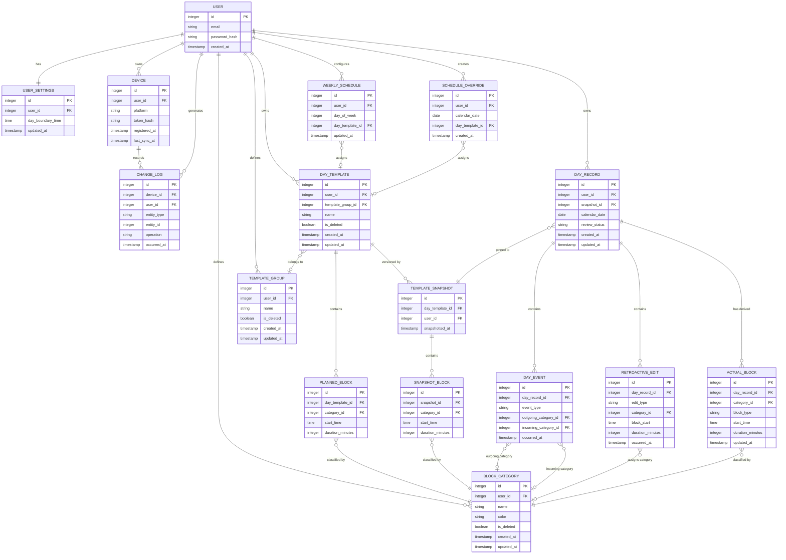

# API Summary

- **Auth**
  - `POST /auth/register` - create account, returns JWT
  - `POST /auth/login` - authenticate, returns JWT

- **Account**
  - `DELETE /account` - hard delete all user data

- **Settings**
  - `GET /settings` - get day boundary time
  - `PUT /settings` - update day boundary time

- **Devices**
  - `POST /devices` - register a new native client device

- **Sync**
  - `POST /sync` - push local change log, receive remote changes since last sync

- **Categories**
  - `GET /categories` - list all active categories
  - `POST /categories` - create category
  - `PUT /categories/{id}` - rename / recolor
  - `DELETE /categories/{id}` - soft delete

- **Template Groups**
  - `GET /template-groups` - list all active groups
  - `POST /template-groups` - create group
  - `PUT /template-groups/{id}` - rename
  - `DELETE /template-groups/{id}` - soft delete

- **Day Templates**
  - `GET /templates` - list all active templates with planned blocks inline
  - `POST /templates` - create template (send copied blocks to implement "Create From")
  - `PUT /templates/{id}` - replace template metadata and full block list; server creates a new snapshot automatically
  - `DELETE /templates/{id}` - soft delete

- **Schedule**
  - `GET /schedule` - get full weekly schedule and all future overrides
  - `PUT /schedule/weekly` - replace all 7 day-of-week assignments
  - `PUT /schedule/overrides/{date}` - set or remove override for a specific date

- **Day Records**
  - `GET /day-records?from=&to=` - fetch records in date range; each record includes its snapshot blocks and actual blocks inline, no raw events or edits
  - `POST /day-records` - create record for a date; server pins the current template snapshot
  - `PUT /day-records/{id}/status` - transition review status (Reviewed / Ignored)
  - `POST /day-records/{id}/events` - append batch of day events (confirmations / transitions); server recomputes actual blocks
  - `POST /day-records/{id}/edits` - append batch of retroactive edits; server recomputes actual blocks

- **Analytics**
  - `GET /analytics/template-health/{template_id}?days=` - per-category planned vs actual breakdown for a template
  - `GET /analytics/overview?weeks=` - cross-template adherence ratios and weekly gap strip


# DB format - V1



Note: For now will use change log to identify what needs synchronization and actual sync will be purely timestamp-based without complex vector-sequence resolution.

Index Suggestions

`CHANGE_LOG`
- **`(user_id, occurred_at)`** — `POST /sync` filters by user and timestamp to find all changes since `last_sync_at`
- **`(device_id, occurred_at)`** — same sync query needs to exclude changes originating from the requesting device

`BLOCK_CATEGORY`
- **`(user_id, is_deleted)`** — `GET /categories` always filters by user and excludes soft-deleted rows

`TEMPLATE_GROUP`
- **`(user_id, is_deleted)`** — `GET /template-groups` always filters by user and excludes soft-deleted rows

`DAY_TEMPLATE`
- **`(user_id, is_deleted)`** — `GET /templates` always filters by user and excludes soft-deleted rows
- **`(template_group_id)`** — grouping/filtering templates by group in template library view

`PLANNED_BLOCK`
- **`(day_template_id)`** — every template fetch joins to its planned blocks; high frequency

`TEMPLATE_SNAPSHOT`
- **`(day_template_id, snapshotted_at)`** — when a day record is created, server must find the most recent snapshot for the assigned template

`SNAPSHOT_BLOCK`
- **`(snapshot_id)`** — every day record fetch joins snapshot to its blocks; high frequency

`WEEKLY_SCHEDULE`
- **`(user_id, day_of_week)`** — schedule lookup on day record creation and `GET /schedule`; always filtered by user and day

`SCHEDULE_OVERRIDE`
- **`(user_id, calendar_date)`** — checked on every day record creation and `GET /schedule` to find overrides; date lookups are the primary access pattern

`DAY_RECORD`
- **`(user_id, calendar_date)`** — `GET /day-records?from=&to=` is always a date range query scoped to a user; core access pattern for week view, analytics, and sync
- **`(user_id, review_status)`** — analytics and overview endpoints filter by status to exclude `Ignored` records; week view counts unreviewed days

`DAY_EVENT`
- **`(day_record_id, occurred_at)`** — events are appended and replayed in order per day record; ordering by time is required for correct block derivation

`RETROACTIVE_EDIT`
- **`(day_record_id, occurred_at)`** — same rationale as `DAY_EVENT`; edits must be replayed in order alongside events during recomputation

`ACTUAL_BLOCK`
- **`(day_record_id)`** — every day record fetch joins to its actual blocks; high frequency, same pattern as `SNAPSHOT_BLOCK`
- **`(day_record_id, start_time)`** — analytics and health view need blocks in time order within a day; also used when recomputing blocks after new events or edits

# API Specification

## Auth

### `POST /auth/register`
Creates a new user account and returns a JWT token.

**Input:**
```json
{
  "email": "string",
  "password": "string"
}
```

**Output `200`:**
```json
{
  "token": "string",
  "user_id": "integer"
}
```

**Errors:**
- `400` — missing or malformed fields
- `409` — email already registered

### `POST /auth/login`
Authenticates an existing user and returns a JWT token.

**Input:**
```json
{
  "email": "string",
  "password": "string"
}
```

**Output `200`:**
```json
{
  "token": "string",
  "user_id": "integer"
}
```

**Errors:**
- `400` — missing or malformed fields
- `401` — invalid credentials

## Account

### `DELETE /account`
Permanently hard-deletes the authenticated user's account and all associated data. Irreversible. Requires the user's password as confirmation.

**Input:**
```json
{
  "password": "string"
}
```

**Output `200`:**
```json
{
  "deleted": true
}
```

**Errors:**
- `401` — invalid password confirmation

## Settings

### `GET /settings`
Returns the current user settings.

**Output `200`:**
```json
{
  "day_boundary_time": "string (ISO 8601)",
  "updated_at": "timestamp (ISO 8601)"
}
```

### `PUT /settings`
Replaces all user settings.

**Input:**
```json
{
  "day_boundary_time": "string (ISO 8601)"
}
```

**Output `200`:**
```json
{
  "day_boundary_time": "string (ISO 8601)",
  "updated_at": "timestamp (ISO 8601)"
}
```

**Errors:**
- `400` — invalid time format

## Devices

### `POST /devices`
Registers a new native client device for the authenticated user. Called once on first launch after web login. The returned `device_id` is stored locally by the client and used to identify the device in subsequent sync calls.

**Input:**
```json
{
  "platform": "string (desktop | mobile | web)"
}
```

**Output `200`:**
```json
{
  "device_id": "integer",
  "registered_at": "timestamp (ISO 8601)"
}
```

**Errors:**
- `400` — invalid or missing platform value

## Sync

### `POST /sync`
The single synchronization endpoint. The client pushes all local changes accumulated since the last sync, and receives all changes made on other devices since `last_sync_at`. Conflict resolution is last-write-wins by `occurred_at` timestamp.

Each change entry in `payload` contains the full current state of the entity using the same shape as the corresponding PUT or POST body for that entity. For deletes, `payload` is null.

After processing, the server updates `last_sync_at` for the device.

**Input:**
```json
{
  "device_id": "integer",
  "last_sync_at": "timestamp | null",
  "changes": [
    {
      "entity_type": "string (category | template_group | day_template | weekly_schedule | schedule_override | day_record | day_event | retroactive_edit | actual_block | settings)",
      "entity_id": "integer",
      "operation": "string (create | update | delete)",
      "occurred_at": "timestamp (ISO 8601)",
      "payload": {}
    }
  ]
}
```

**Output `200`:**
```json
{
  "synced_at": "timestamp (ISO 8601)",
  "changes": [
    {
      "entity_type": "string",
      "entity_id": "integer",
      "operation": "string (create | update | delete)",
      "occurred_at": "timestamp (ISO 8601)",
      "payload": {}
    }
  ],
  "conflicts": [
    {
      "entity_type": "string",
      "entity_id": "integer",
      "note": "string"
    }
  ]
}
```

**Errors:**
- `400` — malformed change log entries
- `404` — unknown `device_id`

## Categories

### `GET /categories`
Returns all non-deleted categories belonging to the authenticated user.

**Output `200`:**
```json
{
  "categories": [
    {
      "id": "integer",
      "name": "string",
      "color": "string (hex)",
      "created_at": "timestamp (ISO 8601)",
      "updated_at": "timestamp (ISO 8601)"
    }
  ]
}
```

### `POST /categories`
Creates a new activity category.

**Input:**
```json
{
  "name": "string",
  "color": "string (hex)"
}
```

**Output `201`:**
```json
{
  "id": "integer",
  "name": "string",
  "color": "string (hex)",
  "created_at": "timestamp (ISO 8601)",
  "updated_at": "timestamp (ISO 8601)"
}
```

**Errors:**
- `400` — missing name or invalid color format

### `PUT /categories/{id}`
Replaces the name and color of an existing category. Changes are reflected immediately everywhere the category appears.

**Input:**
```json
{
  "name": "string",
  "color": "string (hex)"
}
```

**Output `200`:**
```json
{
  "id": "integer",
  "name": "string",
  "color": "string (hex)",
  "updated_at": "timestamp (ISO 8601)"
}
```

**Errors:**
- `400` — missing name or invalid color format
- `404` — category not found or does not belong to user

### `DELETE /categories/{id}`
Soft-deletes a category. The category becomes invisible in the UI but all historical blocks referencing it remain intact. A soft-deleted category cannot be assigned to new blocks.

**Output `200`:**
```json
{
  "id": "integer",
  "deleted": true
}
```

**Errors:**
- `404` — category not found or does not belong to user

## Template Groups

### `GET /template-groups`
Returns all non-deleted template groups belonging to the authenticated user.

**Output `200`:**
```json
{
  "groups": [
    {
      "id": "integer",
      "name": "string",
      "created_at": "timestamp (ISO 8601)",
      "updated_at": "timestamp (ISO 8601)"
    }
  ]
}
```

### `POST /template-groups`
Creates a new template group.

**Input:**
```json
{
  "name": "string"
}
```

**Output `201`:**
```json
{
  "id": "integer",
  "name": "string",
  "created_at": "timestamp (ISO 8601)",
  "updated_at": "timestamp (ISO 8601)"
}
```

**Errors:**
- `400` — missing name

### `PUT /template-groups/{id}`
Replaces the name of an existing template group.

**Input:**
```json
{
  "name": "string"
}
```

**Output `200`:**
```json
{
  "id": "integer",
  "name": "string",
  "updated_at": "timestamp (ISO 8601)"
}
```

**Errors:**
- `400` — missing name
- `404` — group not found or does not belong to user

### `DELETE /template-groups/{id}`
Soft-deletes a template group. Templates previously assigned to this group retain the association in history but the group becomes invisible in the UI.

**Output `200`:**
```json
{
  "id": "integer",
  "deleted": true
}
```

**Errors:**
- `404` — group not found or does not belong to user

## Day Templates

Templates are always returned with their planned blocks inline. Planned blocks have no independent API surface — they are managed as part of the template via full replacement on PUT.

### `GET /templates`
Returns all non-deleted templates with their planned blocks.

**Output `200`:**
```json
{
  "templates": [
    {
      "id": "integer",
      "name": "string",
      "template_group_id": "integer | null",
      "planned_blocks": [
        {
          "id": "integer",
          "category_id": "integer",
          "start_time": "string (ISO 8601)",
          "duration_minutes": "integer"
        }
      ],
      "created_at": "timestamp (ISO 8601)",
      "updated_at": "timestamp (ISO 8601)"
    }
  ]
}
```

### `POST /templates`
Creates a new template with an initial set of planned blocks. To implement "Create From", the client sends the copied blocks from the source template as the initial `planned_blocks`. The server creates a snapshot immediately on creation.

**Input:**
```json
{
  "name": "string",
  "template_group_id": "integer | null",
  "planned_blocks": [
    {
      "category_id": "integer",
      "start_time": "string (ISO 8601)",
      "duration_minutes": "integer"
    }
  ]
}
```

**Output `201`:**
```json
{
  "id": "integer",
  "name": "string",
  "template_group_id": "integer | null",
  "planned_blocks": [
    {
      "id": "integer",
      "category_id": "integer",
      "start_time": "string (ISO 8601)",
      "duration_minutes": "integer"
    }
  ],
  "created_at": "timestamp (ISO 8601)",
  "updated_at": "timestamp (ISO 8601)"
}
```

**Errors:**
- `400` — missing name, invalid block fields, block duration below 30 min or not a 15-min multiple, unknown category_id
- `404` — template_group_id not found or does not belong to user

### `PUT /templates/{id}`
Replaces template metadata and its complete planned block list. Existing blocks are deleted and replaced with the submitted list. The server automatically creates a new `TEMPLATE_SNAPSHOT` after applying the replacement, which will be used by any day records created from this point forward.

**Input:**
```json
{
  "name": "string",
  "template_group_id": "integer | null",
  "planned_blocks": [
    {
      "category_id": "integer",
      "start_time": "string (ISO 8601)",
      "duration_minutes": "integer"
    }
  ]
}
```

**Output `200`:**
```json
{
  "id": "integer",
  "name": "string",
  "template_group_id": "integer | null",
  "planned_blocks": [
    {
      "id": "integer",
      "category_id": "integer",
      "start_time": "string (ISO 8601)",
      "duration_minutes": "integer"
    }
  ],
  "updated_at": "timestamp (ISO 8601)"
}
```

**Errors:**
- `400` — missing name, invalid block fields, block duration below 30 min or not a 15-min multiple, unknown category_id
- `404` — template not found or does not belong to user

### `DELETE /templates/{id}`
Soft-deletes a template. The template becomes invisible in the template library. All day records that used this template retain their pinned snapshot, which is unaffected by the deletion.

**Output `200`:**
```json
{
  "id": "integer",
  "deleted": true
}
```

**Errors:**
- `404` — template not found or does not belong to user

## Schedule

### `GET /schedule`
Returns the complete weekly schedule (all 7 slots, including unassigned days) and all schedule overrides for dates from today onward.

**Output `200`:**
```json
{
  "weekly_schedule": [
    {
      "id": "integer | null",
      "day_of_week": "integer (0=Monday … 6=Sunday)",
      "day_template_id": "integer | null",
      "updated_at": "timestamp | null"
    }
  ],
  "overrides": [
    {
      "id": "integer",
      "calendar_date": "string (YYYY-MM-DD)",
      "day_template_id": "integer | null",
      "created_at": "timestamp (ISO 8601)"
    }
  ]
}
```

### `PUT /schedule/weekly`
Replaces the full weekly schedule. All 7 days of the week must be included. Days with no template assigned should have `day_template_id: null`. Changes apply to future dates only — past day records are unaffected.

**Input:**
```json
{
  "weekly_schedule": [
    {
      "day_of_week": "integer (0–6)",
      "day_template_id": "integer | null"
    }
  ]
}
```

**Output `200`:**
```json
{
  "weekly_schedule": [
    {
      "id": "integer",
      "day_of_week": "integer",
      "day_template_id": "integer | null",
      "updated_at": "timestamp (ISO 8601)"
    }
  ]
}
```

**Errors:**
- `400` — not all 7 days provided, duplicate day_of_week entries, unknown day_template_id
- `404` — any referenced day_template_id not found or does not belong to user

### `PUT /schedule/overrides/{date}`
Creates or replaces the schedule override for a specific calendar date. Sending `day_template_id: null` removes the override, reverting that date to the weekly schedule assignment. `{date}` must be in `YYYY-MM-DD` format.

**Input:**
```json
{
  "day_template_id": "integer | null"
}
```

**Output `200`:**
```json
{
  "id": "integer | null",
  "calendar_date": "string (YYYY-MM-DD)",
  "day_template_id": "integer | null",
  "created_at": "timestamp | null"
}
```

**Errors:**
- `400` — invalid date format, past date
- `404` — day_template_id not found or does not belong to user

## Day Records

Day records are the primary data surface for both the live widget and the review surfaces. Raw events and retroactive edits are internal — the API exposes only the derived `actual_blocks` and the `snapshot_blocks` from the pinned template snapshot. Events and edits are submitted via their own endpoints and trigger server-side recomputation of `actual_blocks`.

### `GET /day-records`
Returns all day records within the specified date range. Each record includes its pinned snapshot blocks and current derived actual blocks inline. No raw events or edits are returned.

**Query params:** `from=YYYY-MM-DD&to=YYYY-MM-DD`

**Output `200`:**
```json
{
  "day_records": [
    {
      "id": "integer",
      "calendar_date": "string (YYYY-MM-DD)",
      "review_status": "string (Unreviewed | Reviewed | Ignored)",
      "snapshot_blocks": [
        {
          "id": "integer",
          "category_id": "integer",
          "start_time": "string (ISO 8601)",
          "duration_minutes": "integer"
        }
      ],
      "actual_blocks": [
        {
          "id": "integer",
          "category_id": "integer | null",
          "block_type": "string (actual | blank | untracked)",
          "start_time": "string (ISO 8601)",
          "duration_minutes": "integer"
        }
      ],
      "created_at": "timestamp (ISO 8601)",
      "updated_at": "timestamp (ISO 8601)"
    }
  ]
}
```

**Errors:**
- `400` — missing or invalid date range format, range exceeds allowed window

### `POST /day-records`
Creates a new day record for a given calendar date. The server resolves the active template for that date (checking schedule overrides first, then the weekly schedule), pins the most recent snapshot of that template to the record, and initializes an empty actual block list. If no template is assigned for that date, the record is created with no snapshot.

**Input:**
```json
{
  "calendar_date": "string (YYYY-MM-DD)"
}
```

**Output `201`:**
```json
{
  "id": "integer",
  "calendar_date": "string (YYYY-MM-DD)",
  "review_status": "Unreviewed",
  "snapshot_blocks": [
    {
      "id": "integer",
      "category_id": "integer",
      "start_time": "string (ISO 8601)",
      "duration_minutes": "integer"
    }
  ],
  "actual_blocks": [],
  "created_at": "timestamp (ISO 8601)",
  "updated_at": "timestamp (ISO 8601)"
}
```

**Errors:**
- `400` — invalid date format
- `409` — a day record already exists for this date

### `PUT /day-records/{id}/status`
Transitions the review status of a day record. Only `Reviewed` and `Ignored` are valid target states — both transitions are permanent and cannot be reversed. A `Reviewed` or `Ignored` record cannot be transitioned again.

**Input:**
```json
{
  "review_status": "string (Reviewed | Ignored)"
}
```

**Output `200`:**
```json
{
  "id": "integer",
  "review_status": "string",
  "updated_at": "timestamp (ISO 8601)"
}
```

**Errors:**
- `400` — invalid status value, or record is already Reviewed or Ignored
- `404` — day record not found or does not belong to user

### `POST /day-records/{id}/events`
Appends one or more day events to a day record in chronological order. Designed for batch submission — native clients accumulate events locally while offline and flush the full batch on sync. After persisting events, the server recomputes and replaces the `actual_blocks` for the day.

Only valid for records with status `Unreviewed`.

**Input:**
```json
{
  "events": [
    {
      "event_type": "string (confirmation | transition)",
      "outgoing_category_id": "integer | null",
      "incoming_category_id": "integer | null",
      "occurred_at": "timestamp (ISO 8601)"
    }
  ]
}
```
- `outgoing_category_id` — required for `transition`, null for `confirmation`
- `incoming_category_id` — required for `transition`, null for `confirmation`

**Output `200`:**
```json
{
  "created_events": [
    {
      "id": "integer",
      "event_type": "string",
      "outgoing_category_id": "integer | null",
      "incoming_category_id": "integer | null",
      "occurred_at": "timestamp (ISO 8601)"
    }
  ],
  "actual_blocks": [
    {
      "id": "integer",
      "category_id": "integer | null",
      "block_type": "string (actual | blank | untracked)",
      "start_time": "string (ISO 8601)",
      "duration_minutes": "integer"
    }
  ]
}
```

**Errors:**
- `400` — invalid event_type, missing required category fields, events not in chronological order
- `403` — day record is Reviewed or Ignored
- `404` — day record not found or does not belong to user

### `POST /day-records/{id}/edits`
Appends one or more retroactive edits to a day record. Used during the Day View review session on the web app. After persisting edits, the server recomputes and replaces the `actual_blocks` for the day.

Only valid for records with status `Unreviewed`.

`edit_type` values:

| Value | Description |
|---|---|
| `resize` | Change duration of a block at a given start time |
| `move` | Reposition a block to a new start time |
| `relabel` | Change the category of a block at a given start time |
| `split` | Split a block at a given start time into two |
| `mark_blank` | Mark a time region as a Blank Block |

**Input:**
```json
{
  "edits": [
    {
      "edit_type": "string (resize | move | relabel | split | mark_blank)",
      "category_id": "integer | null",
      "block_start": "string (ISO 8601)",
      "duration_minutes": "integer | null",
      "occurred_at": "timestamp (ISO 8601)"
    }
  ]
}
```

**Output `200`:**
```json
{
  "created_edits": [
    {
      "id": "integer",
      "edit_type": "string",
      "category_id": "integer | null",
      "block_start": "string (ISO 8601)",
      "duration_minutes": "integer | null",
      "occurred_at": "timestamp (ISO 8601)"
    }
  ],
  "actual_blocks": [
    {
      "id": "integer",
      "category_id": "integer | null",
      "block_type": "string (actual | blank | untracked)",
      "start_time": "string (ISO 8601)",
      "duration_minutes": "integer"
    }
  ]
}
```

**Errors:**
- `400` — invalid edit_type, block_start not on 15-min boundary, duration below 30 min or not a 15-min multiple, unknown category_id
- `403` — day record is Reviewed or Ignored
- `404` — day record not found or does not belong to user

<!-- Still under discussion whether we want to calculate it locally or server-side
## Analytics

Analytics are computed server-side on request from the `ACTUAL_BLOCK` and `SNAPSHOT_BLOCK` tables. Only `Unreviewed` and `Reviewed` day records are included. `Ignored` records are always excluded.

### `GET /analytics/template-health/{template_id}`
Returns the health analysis for a single template over a user-selected time window. Includes per-category planned vs actual breakdown and the overlay data needed to render the frequency heatmap.

**Query params:** `days=integer` (e.g. `days=30`)

**Output `200`:**
```json
{
  "template_id": "integer",
  "template_name": "string",
  "window_days": "integer",
  "record_count": "integer",
  "category_breakdown": [
    {
      "category_id": "integer",
      "category_name": "string",
      "category_color": "string (hex)",
      "planned_minutes_per_day": "integer",
      "actual_avg_minutes_per_day": "number",
      "delta_minutes": "number"
    }
  ],
  "untracked_avg_minutes_per_day": "number",
  "blank_avg_minutes_per_day": "number",
  "overlay_blocks": [
    {
      "category_id": "integer",
      "start_time": "string (ISO 8601)",
      "duration_minutes": "integer",
      "frequency": "number (0.0–1.0)"
    }
  ]
}
```
- `frequency` — proportion of days in the window where an actual block of this category occupied this time slot. Used to drive opacity in the overlay heatmap.

**Errors:**
- `400` — missing or invalid days parameter
- `404` — template not found or does not belong to user

### `GET /analytics/overview`
Returns cross-template adherence per category and a weekly gap strip for recent weeks. Covers all non-Ignored day records regardless of which template was active.

**Query params:** `weeks=integer` (number of recent weeks, default `4`)

**Output `200`:**
```json
{
  "adherence": [
    {
      "category_id": "integer",
      "category_name": "string",
      "category_color": "string (hex)",
      "planned_avg_minutes_per_day": "number",
      "actual_avg_minutes_per_day": "number",
      "adherence_ratio": "number"
    }
  ],
  "weekly_gap_strip": [
    {
      "week_start": "string (YYYY-MM-DD)",
      "days": [
        {
          "calendar_date": "string (YYYY-MM-DD)",
          "has_any_actual_blocks": "boolean",
          "review_status": "string (Unreviewed | Reviewed | Ignored)"
        }
      ]
    }
  ]
}
```
- `adherence_ratio` — `actual_avg / planned_avg`. Values above 1.0 indicate over-allocation; below 1.0 indicate under-allocation.

**Errors:**
- `400` — invalid weeks parameter -->
