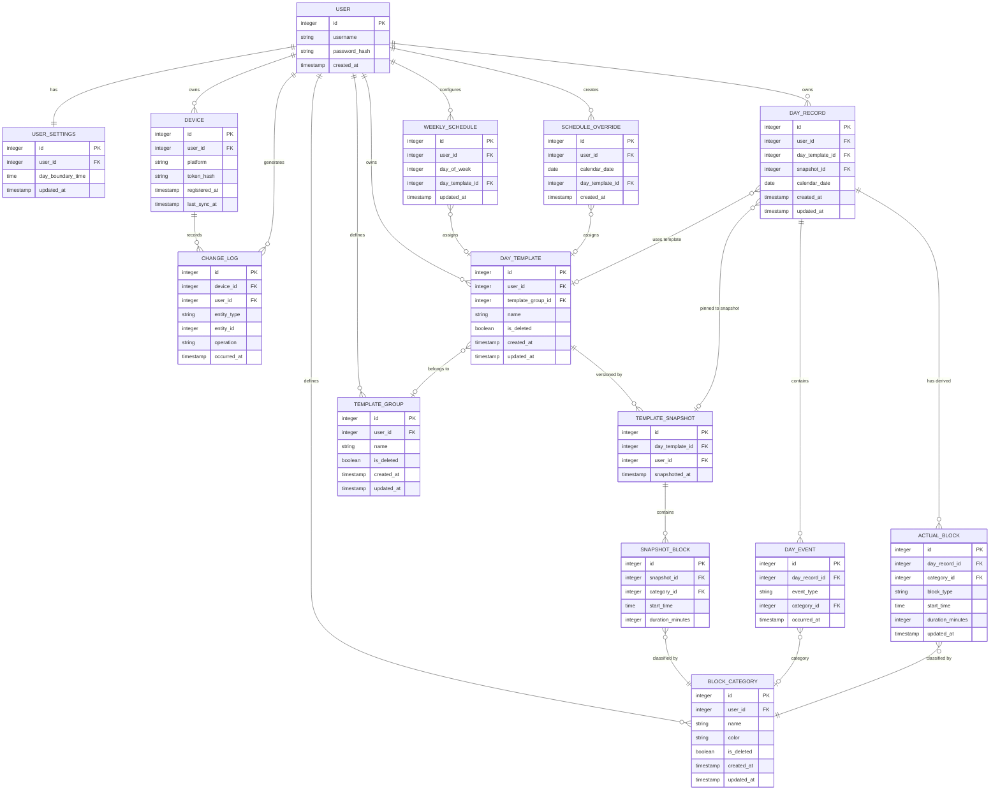

# API Summary

- **Auth**
  - `POST /auth/register` - create account, returns JWT
  - `POST /auth/login` - authenticate, returns JWT

- **Account**
  - `DELETE /account` - hard delete all user data

- **Settings**
  - `GET /settings` - get day boundary time
  - `PUT /settings` - update day boundary time

- **Devices**
  - `POST /devices` - register a new native client device

- **Sync**
  - `POST /sync` - push local change log, receive remote changes since last sync

- **Categories**
  - `GET /categories` - list all active categories
  - `POST /categories` - create category
  - `PUT /categories/{id}` - rename / recolor
  - `DELETE /categories/{id}` - soft delete

- **Template Groups**
  - `GET /template-groups` - list all active groups
  - `POST /template-groups` - create group
  - `PUT /template-groups/{id}` - rename
  - `DELETE /template-groups/{id}` - soft delete

- **Day Templates**
  - `GET /templates` - list all active templates with their current snapshot blocks inline
  - `POST /templates` - create template (send copied blocks to implement "Create From")
  - `PUT /templates/{id}` - update template metadata and create a new snapshot; active/future days using the template are re-pinned
  - `DELETE /templates/{id}` - soft delete a template

- **Schedule**
  - `GET /schedule` - get full weekly schedule and all future overrides
  - `GET /schedule/today` - resolve today's schedule assignment and return its template with planned blocks
  - `PUT /schedule/weekly` - replace all 7 day-of-week assignments
  - `PUT /schedule/overrides/{date}` - set or remove override for a specific date

- **Day Records**
  - `GET /day-records?from=&to=` - fetch existing records in date range; missing dates are omitted, and each record includes its snapshot blocks and actual blocks inline
  - `POST /day-records` - create a record for a calendar date and pin the active template snapshot
  - `PUT /day-records/{id}/template` - re-resolve or explicitly assign the template and re-pin an active/future day
  - `POST /day-records/{id}/events` - append batch of day events (confirmations / transitions); recomputes actual blocks
  - `PUT /day-records/{id}` - replace the actual blocks for a day during review


# DB format - V1



Index Suggestions

`CHANGE_LOG`
- **`(user_id, occurred_at)`** — `POST /sync` filters by user and timestamp to find all changes since `last_sync_at`
- **`(device_id, occurred_at)`** — same sync query needs to exclude changes originating from the requesting device

`BLOCK_CATEGORY`
- **`(user_id, is_deleted)`** — `GET /categories` always filters by user and excludes soft-deleted rows

`TEMPLATE_GROUP`
- **`(user_id, is_deleted)`** — `GET /template-groups` always filters by user and excludes soft-deleted rows

`DAY_TEMPLATE`
- **`(user_id, is_deleted)`** — `GET /templates` always filters by user and excludes soft-deleted rows
- **`(template_group_id)`** — grouping/filtering templates by group in template library view

`TEMPLATE_SNAPSHOT`
- **`(day_template_id, snapshotted_at)`** — when a day record is created, server must find the most recent snapshot for the assigned template

`SNAPSHOT_BLOCK`
- **`(snapshot_id)`** — every day record fetch joins snapshot to its blocks; high frequency

`WEEKLY_SCHEDULE`
- **`(user_id, day_of_week)`** — schedule lookup on day record creation and `GET /schedule`; always filtered by user and day

`SCHEDULE_OVERRIDE`
- **`(user_id, calendar_date)`** — checked on every day record creation and `GET /schedule` to find overrides; date lookups are the primary access pattern

`DAY_RECORD`
- **`(user_id, calendar_date)`** — `GET /day-records?from=&to=` is always a date range query scoped to a user; core access pattern for week view, analytics, and sync
- **`(snapshot_id)`** — every day record fetch joins its pinned snapshot to retrieve the planned schedule

`DAY_EVENT`
- **`(day_record_id, occurred_at)`** — events are appended and replayed in order per day record; ordering by time is required for correct block derivation

`ACTUAL_BLOCK`
- **`(day_record_id)`** — every day record fetch joins to its actual blocks; high frequency, same pattern as `SNAPSHOT_BLOCK`
- **`(day_record_id, start_time)`** — analytics and health view need blocks in time order within a day; also used when recomputing blocks after new events.

# API Specification

## Auth

### `POST /auth/register`
Creates a new user account and returns a JWT token.

**Input:**
```json
{
  "username": "string",
  "password": "string"
}
```

**Output `200`:**
```json
{
  "token": "string",
  "user_id": "integer"
}
```

**Errors:**
- `400` — missing or malformed fields
- `409` — username already registered

### `POST /auth/login`
Authenticates an existing user and returns a JWT token.

**Input:**
```json
{
  "username": "string",
  "password": "string"
}
```

**Output `200`:**
```json
{
  "token": "string",
  "user_id": "integer"
}
```

**Errors:**
- `400` — missing or malformed fields
- `401` — invalid credentials

## Account

### `DELETE /account`
Permanently hard-deletes the authenticated user's account and all associated data. Irreversible. Requires the user's password as confirmation.

**Input:**
```json
{
  "password": "string"
}
```

**Output `200`:**
```json
{
  "deleted": true
}
```

**Errors:**
- `401` — invalid password confirmation

## Settings

### `GET /settings`
Returns the current user settings.

**Output `200`:**
```json
{
  "day_boundary_time": "string (ISO 8601)",
  "updated_at": "timestamp (ISO 8601)"
}
```

### `PUT /settings`
Replaces all user settings.

**Input:**
```json
{
  "day_boundary_time": "string (ISO 8601)"
}
```

**Output `200`:**
```json
{
  "day_boundary_time": "string (ISO 8601)",
  "updated_at": "timestamp (ISO 8601)"
}
```

**Errors:**
- `400` — invalid time format

## Devices

### `POST /devices`
Registers a new native client device for the authenticated user. Called once on first launch after web login. The returned `device_id` is stored locally by the client and used to identify the device in subsequent sync calls.

**Input:**
```json
{
  "platform": "string (desktop | mobile | web)"
}
```

**Output `200`:**
```json
{
  "device_id": "integer",
  "registered_at": "timestamp (ISO 8601)"
}
```

**Errors:**
- `400` — invalid or missing platform value

## Sync

### `POST /sync`
The single synchronization endpoint. The client pushes all local changes accumulated since the last sync, and receives all changes made on other devices since `last_sync_at`. Conflict resolution is last-write-wins by `occurred_at` timestamp.

Each change entry in `payload` contains the full current state of the entity using the same shape as the corresponding PUT or POST body for that entity. For deletes, `payload` is null.

After processing, the server updates `last_sync_at` for the device.

**Input:**
```json
{
  "device_id": "integer",
  "last_sync_at": "timestamp | null",
  "changes": [
    {
      "entity_type": "string (category | template_group | day_template | weekly_schedule | schedule_override | day_record | day_event | actual_block | settings)",
      "entity_id": "integer",
      "operation": "string (create | update | delete)",
      "occurred_at": "timestamp (ISO 8601)",
      "payload": {}
    }
  ]
}
```

**Output `200`:**
```json
{
  "synced_at": "timestamp (ISO 8601)",
  "changes": [
    {
      "entity_type": "string",
      "entity_id": "integer",
      "operation": "string (create | update | delete)",
      "occurred_at": "timestamp (ISO 8601)"
    }
  ],
  "conflicts": [
    {
      "entity_type": "string",
      "entity_id": "integer",
      "note": "string"
    }
  ]
}
```

**Errors:**
- `400` — malformed change log entries
- `404` — unknown `device_id`

## Categories

### `GET /categories`
Returns all non-deleted categories belonging to the authenticated user.

**Output `200`:**
```json
{
  "categories": [
    {
      "id": "integer",
      "name": "string",
      "color": "string (hex)",
      "created_at": "timestamp (ISO 8601)",
      "updated_at": "timestamp (ISO 8601)"
    }
  ]
}
```

### `POST /categories`
Creates a new activity category.

**Input:**
```json
{
  "name": "string",
  "color": "string (hex)"
}
```

**Output `201`:**
```json
{
  "id": "integer",
  "name": "string",
  "color": "string (hex)",
  "created_at": "timestamp (ISO 8601)",
  "updated_at": "timestamp (ISO 8601)"
}
```

**Errors:**
- `400` — missing name or invalid color format

### `PUT /categories/{id}`
Replaces the name and color of an existing category. Changes are reflected immediately everywhere the category appears.

**Input:**
```json
{
  "name": "string",
  "color": "string (hex)"
}
```

**Output `200`:**
```json
{
  "id": "integer",
  "name": "string",
  "color": "string (hex)",
  "updated_at": "timestamp (ISO 8601)"
}
```

**Errors:**
- `400` — missing name or invalid color format
- `404` — category not found or does not belong to user

### `DELETE /categories/{id}`
Soft-deletes a category. The category becomes invisible in the UI but all historical blocks referencing it remain intact. A soft-deleted category cannot be assigned to new blocks.

**Output `200`:**
```json
{
  "id": "integer",
  "deleted": true
}
```

**Errors:**
- `404` — category not found or does not belong to user

## Template Groups

### `GET /template-groups`
Returns all non-deleted template groups belonging to the authenticated user.

**Output `200`:**
```json
{
  "groups": [
    {
      "id": "integer",
      "name": "string",
      "created_at": "timestamp (ISO 8601)",
      "updated_at": "timestamp (ISO 8601)"
    }
  ]
}
```

### `POST /template-groups`
Creates a new template group.

**Input:**
```json
{
  "name": "string"
}
```

**Output `201`:**
```json
{
  "id": "integer",
  "name": "string",
  "created_at": "timestamp (ISO 8601)",
  "updated_at": "timestamp (ISO 8601)"
}
```

**Errors:**
- `400` — missing name

### `PUT /template-groups/{id}`
Replaces the name of an existing template group.

**Input:**
```json
{
  "name": "string"
}
```

**Output `200`:**
```json
{
  "id": "integer",
  "name": "string",
  "updated_at": "timestamp (ISO 8601)"
}
```

**Errors:**
- `400` — missing name
- `404` — group not found or does not belong to user

### `DELETE /template-groups/{id}`
Soft-deletes a template group. Templates previously assigned to this group retain the association in history but the group becomes invisible in the UI.

**Output `200`:**
```json
{
  "id": "integer",
  "deleted": true
}
```

**Errors:**
- `404` — group not found or does not belong to user

## Day Templates

Templates are returned with the current template snapshot and its schedule blocks inline. Snapshot blocks have no independent API surface — they are managed as part of template creation or snapshot creation on PUT.

### `GET /templates`
Returns all non-deleted templates with their current snapshot and schedule blocks.

**Output `200`:**
```json
{
  "templates": [
    {
      "id": "integer",
      "name": "string",
      "template_group_id": "integer | null",
      "current_snapshot": {
        "id": "integer",
        "snapshotted_at": "timestamp (ISO 8601)",
        "snapshot_blocks": [
          {
            "id": "integer",
            "category_id": "integer",
            "start_time": "string (ISO 8601)",
            "duration_minutes": "integer"
          }
        ]
      },
      "created_at": "timestamp (ISO 8601)",
      "updated_at": "timestamp (ISO 8601)"
    }
  ]
}
```

### `POST /templates`
Creates a new template with general metadata and an initial schedule. To implement "Create From", the client sends the copied blocks from the source template as the initial `snapshot_blocks`. The server creates the first template snapshot immediately on creation.

**Input:**
```json
{
  "name": "string",
  "template_group_id": "integer | null",
  "snapshot_blocks": [
    {
      "category_id": "integer",
      "start_time": "string (ISO 8601)",
      "duration_minutes": "integer"
    }
  ]
}
```

**Output `201`:**
```json
{
  "id": "integer",
  "name": "string",
  "template_group_id": "integer | null",
  "current_snapshot": {
    "id": "integer",
    "snapshotted_at": "timestamp (ISO 8601)",
    "snapshot_blocks": [
      {
        "id": "integer",
        "category_id": "integer",
        "start_time": "string (ISO 8601)",
        "duration_minutes": "integer"
      }
    ]
  },
  "created_at": "timestamp (ISO 8601)",
  "updated_at": "timestamp (ISO 8601)"
}
```

**Errors:**
- `400` — missing name, invalid block fields, block duration below 30 min or not a 15-min multiple, unknown category_id
- `404` — template_group_id not found or does not belong to user

### `PUT /templates/{id}`
Replaces the template metadata and creates a new template snapshot containing the submitted schedule. Existing snapshots and their blocks are retained unchanged for historical records.

Existing active/future day records for this template are re-pinned from their old snapshot to the new snapshot. Their actual blocks and events are unchanged. Past day records are frozen and are never re-pinned automatically.

**Input:**
```json
{
  "name": "string",
  "template_group_id": "integer | null",
  "snapshot_blocks": [
    {
      "category_id": "integer",
      "start_time": "string (ISO 8601)",
      "duration_minutes": "integer"
    }
  ]
}
```

**Output `200`:**
```json
{
  "id": "integer",
  "name": "string",
  "template_group_id": "integer | null",
  "current_snapshot": {
    "id": "integer",
    "snapshotted_at": "timestamp (ISO 8601)",
    "snapshot_blocks": [
      {
        "id": "integer",
        "category_id": "integer",
        "start_time": "string (ISO 8601)",
        "duration_minutes": "integer"
      }
    ]
  },
  "updated_at": "timestamp (ISO 8601)"
}
```

**Errors:**
- `400` — missing name, invalid block fields, block duration below 30 min or not a 15-min multiple, unknown category_id
- `404` — template not found or does not belong to user

### `DELETE /templates/{id}`
Soft-deletes a template. The template becomes invisible in the template library. All day records that used the template retain their pinned snapshot, which is unaffected by the deletion.

**Output `200`:**
```json
{
  "id": "integer",
  "deleted": true
}
```

**Errors:**
- `404` — template not found or does not belong to user

## Schedule

### `GET /schedule`
Returns the complete weekly schedule (all 7 slots, including unassigned days) and all schedule overrides for dates from today onward.

**Output `200`:**
```json
{
  "weekly_schedule": [
    {
      "id": "integer | null",
      "day_of_week": "integer (0=Monday … 6=Sunday)",
      "day_template_id": "integer | null",
      "updated_at": "timestamp | null"
    }
  ],
  "overrides": [
    {
      "id": "integer",
      "calendar_date": "string (YYYY-MM-DD)",
      "day_template_id": "integer | null",
      "created_at": "timestamp (ISO 8601)"
    }
  ]
}
```

### `GET /schedule/today`
Returns the template assignment resolved for the current calendar date. A date-specific override takes precedence over the weekly schedule. This endpoint is intended for live clients that need the current planned template and does not require a day record to exist.

**Output `200`:**
```json
{
  "calendar_date": "string (YYYY-MM-DD)",
  "day_template_id": "integer | null",
  "template": {
    "id": "integer",
    "name": "string",
    "template_group_id": "integer | null",
    "current_snapshot": {
      "id": "integer",
      "snapshotted_at": "timestamp (ISO 8601)",
      "snapshot_blocks": []
    }
  }
}
```

When no template is assigned, `day_template_id` and `template` are `null`.

### `PUT /schedule/weekly`
Replaces the full weekly schedule. All 7 days of the week must be included. Days with no template assigned should have `day_template_id: null`. Changes apply to active and future dates — past day records are frozen and unaffected. Existing active/future day records are re-resolved and re-pinned when their assignment changes.

**Input:**
```json
{
  "weekly_schedule": [
    {
      "day_of_week": "integer (0–6)",
      "day_template_id": "integer | null"
    }
  ]
}
```

**Output `200`:**
```json
{
  "weekly_schedule": [
    {
      "id": "integer",
      "day_of_week": "integer",
      "day_template_id": "integer | null",
      "updated_at": "timestamp (ISO 8601)"
    }
  ]
}
```

**Errors:**
- `400` — not all 7 days provided, duplicate day_of_week entries, unknown day_template_id
- `404` — any referenced day_template_id not found or does not belong to user

### `PUT /schedule/overrides/{date}`
Creates or replaces the schedule override for a specific calendar date. Sending `day_template_id: null` removes the override, reverting that date to the weekly schedule assignment. Existing active/future day records for the date are re-resolved and re-pinned. `{date}` must be in `YYYY-MM-DD` format.

**Input:**
```json
{
  "day_template_id": "integer | null"
}
```

**Output `200`:**
```json
{
  "id": "integer | null",
  "calendar_date": "string (YYYY-MM-DD)",
  "day_template_id": "integer | null",
  "created_at": "timestamp | null"
}
```

**Errors:**
- `400` — invalid date format, past date
- `404` — day_template_id not found or does not belong to user

## Day Records

Day records are the primary data surface for both the live widget and the review surfaces. Raw events are internal — the API exposes only the current `actual_blocks` and the `snapshot_blocks` from the pinned template snapshot. Records are created explicitly through `POST /day-records`. Events trigger server-side recomputation of `actual_blocks`; review changes replace the actual block list through `PUT /day-records/{id}`.

### `GET /day-records`
Returns existing day records within the specified date range. Dates without a day record are omitted and do not initialize one. Each returned record includes its template identity, pinned snapshot identity and blocks, and current derived actual blocks inline.

**Query params:** `from=YYYY-MM-DD&to=YYYY-MM-DD`

**Output `200`:**
```json
{
  "day_records": [
    {
      "id": "integer",
      "calendar_date": "string (YYYY-MM-DD)",
      "day_template_id": "integer | null",
      "snapshot_id": "integer | null",
      "snapshot_blocks": [
        {
          "id": "integer",
          "category_id": "integer",
          "start_time": "string (ISO 8601)",
          "duration_minutes": "integer"
        }
      ],
      "actual_blocks": [
        {
          "id": "integer",
          "category_id": "integer | null",
          "block_type": "string (actual | blank | untracked)",
          "start_time": "string (ISO 8601)",
          "duration_minutes": "integer"
        }
      ],
      "created_at": "timestamp (ISO 8601)",
      "updated_at": "timestamp (ISO 8601)"
    }
  ]
}
```

**Errors:**
- `400` — missing or invalid date range format, or the end date precedes the start date

### `POST /day-records`
Creates a new day record for a calendar date. The server resolves the active template for that date, checking schedule overrides first and then the weekly schedule, and pins the most recent snapshot of that template to the record. If no template is assigned, the record is created without a template or snapshot.

**Input:**
```json
{
  "calendar_date": "string (YYYY-MM-DD)"
}
```

**Output `201`:**
```json
{
  "id": "integer",
  "calendar_date": "string (YYYY-MM-DD)",
  "day_template_id": "integer | null",
  "snapshot_id": "integer | null",
  "snapshot_blocks": [],
  "actual_blocks": [],
  "created_at": "timestamp (ISO 8601)",
  "updated_at": "timestamp (ISO 8601)"
}
```

**Errors:**
- `400` — invalid date format
- `409` — a day record already exists for this date

### `PUT /day-records/{id}/template`
Changes the planned template for an active or future day record without changing its events or actual blocks. Past day records are frozen. If `day_template_id` is `null`, the server resolves the template from the date override and weekly schedule. If a template ID is provided, the server uses that template's latest snapshot. The day record stores both the selected template ID and the pinned snapshot ID.

**Input:**
```json
{
  "day_template_id": "integer | null"
}
```

**Output `200`:**
```json
{
  "id": "integer",
  "calendar_date": "string (YYYY-MM-DD)",
  "day_template_id": "integer | null",
  "snapshot_id": "integer | null",
  "snapshot_blocks": [
    {
      "id": "integer",
      "category_id": "integer",
      "start_time": "string (ISO 8601)",
      "duration_minutes": "integer"
    }
  ],
  "actual_blocks": [
    {
      "id": "integer",
      "category_id": "integer | null",
      "block_type": "string (actual | blank | untracked)",
      "start_time": "string (ISO 8601)",
      "duration_minutes": "integer"
    }
  ],
  "updated_at": "timestamp (ISO 8601)"
}
```

**Rules:**
- Only active or future day records can be re-pinned.
- `day_template_id: null` removes the plan if no template is resolved from the current schedule.
- Actual blocks and events are unaffected.

**Errors:**
- `400` — day record is in the past
- `404` — day record or explicit template not found or does not belong to user

### `POST /day-records/{id}/events`
Appends one or more day events to the existing day record identified by `{id}` in chronological order. Designed for batch submission — native clients accumulate events locally while offline and flush the full batch on sync. After persisting events, the server recomputes and replaces the `actual_blocks` for the day.

Actual blocks may be recorded or corrected for any day record. Snapshot assignment remains immutable for past records.

**Input:**
```json
{
  "events": [
    {
      "event_type": "string (confirmation | transition)",
      "category_id": "integer | null",
      "occurred_at": "timestamp (ISO 8601)"
    }
  ]
}
```
- `category_id` — required for all events

**Output `200`:**
```json
{
  "created_events": [
    {
      "id": "integer",
      "event_type": "string",
      "category_id": "integer | null",
      "occurred_at": "timestamp (ISO 8601)"
    }
  ],
  "actual_blocks": [
    {
      "id": "integer",
      "category_id": "integer | null",
      "block_type": "string (actual | blank | untracked)",
      "start_time": "string (ISO 8601)",
      "duration_minutes": "integer"
    }
  ]
}
```

**Errors:**
- `400` — invalid event_type, missing required category fields, events not in chronological order
- `404` — day record not found or does not belong to user

### `PUT /day-records/{id}`
Replaces the complete actual block list for the day record for `{id}`.

Used during the Day View to correct or reconstruct the actual timeline. Actual blocks may be changed for any day record, including past records. Snapshot assignment remains immutable for past records.

**Input:**
```json
{
  "actual_blocks": [
    {
      "category_id": "integer | null",
      "block_type": "string (actual | blank)",
      "start_time": "string (ISO 8601)",
      "duration_minutes": "integer"
    }
  ]
}
```
- `category_id` is required for `actual` blocks and must be `null` for `blank` blocks.
- Actual and blank blocks must use 15-minute start and duration increments, have a minimum duration of 30 minutes, and must not overlap.
- Untracked gaps are derived by the server from the gaps between submitted blocks and are returned in the response.

**Output `200`:**
```json
{
  "actual_blocks": [
    {
      "id": "integer",
      "category_id": "integer | null",
      "block_type": "string (actual | blank | untracked)",
      "start_time": "string (ISO 8601)",
      "duration_minutes": "integer"
    }
  ],
  "updated_at": "timestamp (ISO 8601)"
}
```

**Errors:**
- `400` — invalid block fields, overlapping blocks, invalid 15-minute boundary, duration below 30 minutes or not a 15-minute multiple, unknown category_id
- `404` — day record not found or does not belong to user
